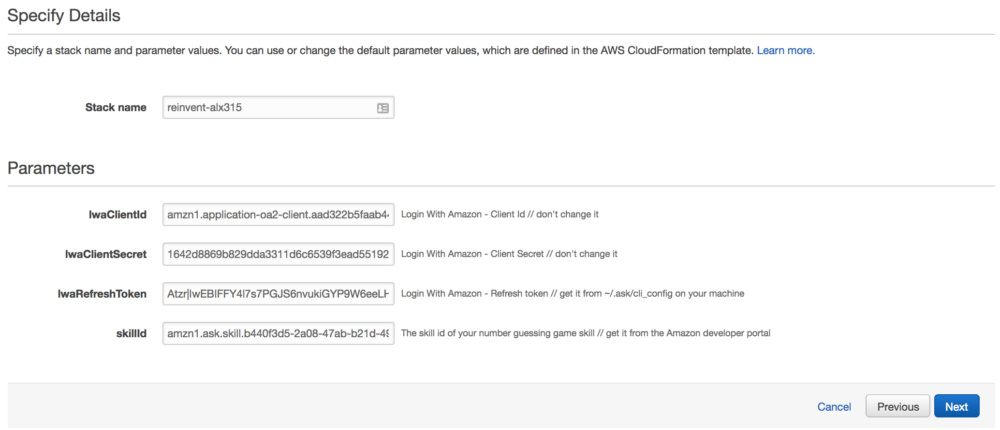

[<< Lab 3](lab03.md) | **Lab 4** | [Lab 5 >>](lab05.md)

# ALX315 - Lab Guide 4 - Set up the Test SDK and Client

## **What you will do in this lab**
The Test SDK provided for this lab is a custom implementation that leverages SMAPI in a similar way ask-cli does. It keeps track of session state and supports multiturn dialogs. You'll configure the SDK tool to get started for the next labs. 

## **What you will get at the end of this lab**
You have learned how to configure the Test SDK tool and fire a request at the skill that has been defined in a YAML script file.

## **Instructions**

### **4.1) Set up Login With Amazon (LWA) credentials** 

LWA credentials are required by the test client to get access to your skill. You need three things: a _client-id_, a _client-secret_ and _refresh-token_ from LWA.

**4.1.1.** Open the [/assets/lwa-credentials.txt](../assets/lwa-credentials.txt) file in this repo on your local drive. You will store the above-mentioned settings in this file.

**4.1.2.** Go to the [Amazon developer console](https://developer.amazon.com/), click on _Developer Console_ in the header section and navigate to _Apps & Services_ 

**4.1.3.** Click on _Login With Amazon_ and _Create A New Security Profile_


**4.1.4.** Give it a name, description and policy-url _https://<span></span>example<span></span>.com_ as suggested below and hit _Save_.


**4.1.5.** Click on _Show ClientID and Secret_. Copy the client-id and client-secret and paste them into [./assets/lwa-credentials.txt](../assets/lwa-credentials.txt). 

**4.1.6.** Back in the browser, go to _Manage_ -> _Web Settings_ and click on _Edit_. Set _https://<span></span>example<span></span>.com_ as the _Allowed Return Url_.

**4.1.7.** Browse to 

https://<span></span>www.amazon<span></span>.com/ap/oa?client_id=__{clientId}__&scope=alexa::ask:skills:test&response_type=code&redirect_uri=https://example.com 

after you replaced __{clientId}__ with your clientId you pasted into the lab04.yml file

**4.1.8.** Follow the authentication and authorization procedure. You end up being redirected to example<span></span>.com. Look at the URL in the address line of your browser. It should contain an authorization _code_.

**4.1.9.** Take the code you retrieved in the previous step and use it in the following HTTP POST request command in your local shell.

```bash
curl -d "client_id={clientId}&client_secret={secret}&code={code}&grant_type=authorization_code&redirect_uri=https://example.com" -H "Content-Type: application/x-www-form-urlencoded" -X POST https://api.amazon.com/auth/o2/token
```
- where _{clientId}_ needs to be replaced by the clientId you got in step 4.1.5.
- where _{secret}_ needs to be replaced by the clientSecret you got in step 4.1.5.
- where _{code}_ needs to be replaced by the authorization code you received in step 4.1.8.

This curl command returns a JSON payload that contains the refresh token you need. Copy and paste it into the [./assets/lwa-credentials.txt](../assets/lwa-credentials.txt) file.

**Side note** If you made a mistake in step 4.1.9. and retrieve an error it is necessary to return to step 4.1.7. as the authorization code is only valid for one request.

### **4.2) Deploy the test environment in AWS** 

You will use a CloudFormation template to create an S3 bucket and a Lambda function which hosts the test client tool written in Java.

**4.2.1.** Go to the [AWS developer console](https://console.aws.amazon.com/console/home) and log in with your AWS credentials.

**4.2.2.** Go to _Services_ -> _CloudFormation_ and click on __Create Stack__. 

**4.2.3.** Select __Upload a template to Amazon S3__ and __Choose file__. Navigate to [./assets/aws-stack.json](../assets/aws-stack.json) in this repo. Click __Next__.

**4.2.4.** Set the following
- __Stack name:__ reinvent-alx315
- __lwaClientId, lwaClientSecret, lwaRefreshToken:__ the Login With Amazon credentials you stored in the [./assets/lwa-credentials.txt](../assets/lwa-credentials.txt) file.



Click on __Next__. 

**4.2.5.** Click on __Next__. 

**4.2.6.** Click on __I acknowledge that AWS CloudFormation might create IAM resources.__ and confirm with __Create__.

The stack creates an S3 bucket and a Lambda function which hosts the test client. When the status indicates _CREATE_COMPLETE_ go to the _Resource_ tab at the bottom of this page.


**4.2.7.** In the _Resources_ tab you should see three resources which have been created in your AWS account. Follow the links to the _TestClientLambda_ and _TestScriptBucket_ resource. Each of them will open in up in a new browser tab. Leave them open until the end of this workshop as you will return to your bucket and Lambda function in the upcoming labs.

### **4.3) Run your first test script** 

**4.3.1.** Navigate to the [./scripts/lab04.yml](../scripts/lab04.yml) in this repo. This is your first conversation test script. Paste the Skill Id of your _number guessing game_ skill in the value portion of the _skillId_ property in this file.

**4.3.2.** Return to the S3 bucket windows in your browser. The bucket should have a name similar to _reinvent-alx315-testscriptbucket-xxxxxxxxxx_. 

**4.3.3.** __Upload__ the [./scripts/lab04.yml](../scripts/lab04.yml) from your local drive into this bucket.

**4.3.4.** Switch to the browser tab with the overview of your _reinvent-alx315-test-client_ Lambda function. Look at the environment variables already set for you. This Lambda function will access the skill referenced in the lab04.yml file you just uploaded to S3 with help of your Login With Amazon credentials.

**4.3.5.** Hit __Test__ to execute the Lambda function. You might have to configure a test event first. Choose the _Hello World_ example event as the Lambda function does not expect anything specific as an input.

**4.3.6.** Look at the _log output_ once the Lambda execution is finished.

__Q4.3.1__: From what is in the lab04.yml and in the Lambda _log output_, can you describe what just happened?

Congratulations. You ran your first automated test. 

[<< Lab 3](lab03.md) | **Lab 4** | [Lab 5 >>](lab05.md)